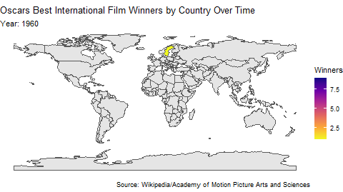

```{r setup, include=FALSE}
library(tidyverse)
knitr::opts_chunk$set(echo = FALSE)
```
### Oscars Best International Feature Film Over Time
```{r Oscars First Time,out.width="48%",out.height="20%",fig.align='center'}

knitr::include_graphics(c("biff_over_time_animation.gif","biff_winners_over_time_animation.gif"))
knitr::include_graphics(c("bafta_over_time_animation.gif","bafta_winners_over_time_animation.gif"))
knitr::include_graphics("palme_over_time_animation.gif")
```

```{r Oscars BIFF,out.width="40%",out.height="20%",fig.show='hold',fig.align='center'}
knitr::include_graphics(c("biff_over_time_animation.gif",   "biff_winners_over_time_animation.gif"))
```

 

### BAFTA Best Foreign Film Over Time
```{r BAFTA,out.width="40%",out.height="20%",fig.show='hold',fig.align='center'}
knitr::include_graphics(c("bafta_over_time_animation.gif",   "bafta_winners_over_time_animation.gif"))
```

### Cannes Film Festival Palme D'Or Winners Over Time
```{r Palme,out.width="40%",out.height="20%",fig.show='hold',fig.align='center'}
knitr::include_graphics("palme_over_time_animation.gif")
```

